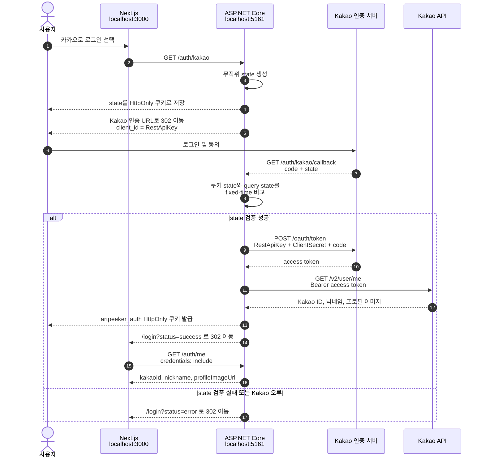

# Kakao 로그인 흐름

이 문서는 Artpeeker의 Kakao OAuth 로그인 과정과 `RestApiKey`, `ClientSecret`의 역할을 설명합니다.

## 설정값의 역할

| 설정 | 역할 | 노출 범위 |
| --- | --- | --- |
| `RestApiKey` | Kakao에 어떤 애플리케이션의 요청인지 알리는 `client_id` | 로그인 URL에 포함될 수 있으므로 공개 식별자에 가깝지만 안전하게 관리합니다. |
| `ClientSecret` | 인가 코드를 토큰으로 교환할 때 백엔드 요청을 추가로 인증하는 `client_secret` | 백엔드에서만 사용하며 Git, 프론트엔드, 로그에 노출하지 않습니다. |
| `RedirectUri` | Kakao 인증 후 돌아올 백엔드 콜백 주소 | Kakao Developers에 등록한 URI와 정확히 일치해야 합니다. |
| `FrontendLoginUrl` | 로그인 처리 결과를 표시할 프론트엔드 주소 | 성공 또는 오류 query string과 함께 사용됩니다. |
| `Scope` | Kakao에 요청할 사용자 정보 범위 | 현재 닉네임과 프로필 이미지를 요청합니다. |

Client Secret은 Kakao Developers에서 활성화한 경우에만 필요합니다. 활성화했다면 로컬 설정의 값도 반드시 일치해야 합니다.

## 전체 흐름



## 로컬 개발 설정

로컬 값은 Git에서 제외된 `backend/appsettings.Development.json`에 둡니다.

```json
{
  "Kakao": {
    "RestApiKey": "",
    "ClientSecret": "",
    "RedirectUri": "http://localhost:5161/auth/kakao/callback",
    "FrontendLoginUrl": "http://localhost:3000/login",
    "Scope": "profile_nickname,profile_image"
  }
}
```

실제 키와 Client Secret은 예시나 문서에 입력하지 않습니다. `appsettings.Development.json`이 Git에서 제외되는지는 다음 명령으로 확인합니다.

```bash
git check-ignore -v backend/appsettings.Development.json
```

## 보안 체크리스트

- OAuth `state`는 예측할 수 없는 난수로 생성합니다.
- 저장한 `state`와 콜백의 `state`는 fixed-time 비교로 검증합니다.
- state 쿠키와 로그인 쿠키는 `HttpOnly`로 유지합니다.
- `ClientSecret`, Kakao 토큰, 인증 쿠키를 Git이나 로그에 기록하지 않습니다.
- 프론트엔드 코드나 `NEXT_PUBLIC_` 환경 변수에 `ClientSecret`을 넣지 않습니다.
- Kakao Developers의 Redirect URI와 백엔드 `RedirectUri`를 정확히 일치시킵니다.

## 관련 엔드포인트

- `GET /auth/kakao`: 로그인 시작 및 Kakao 인증 페이지 이동
- `GET /auth/kakao/callback`: state 검증, 토큰 교환 및 사용자 정보 조회
- `GET /auth/me`: 현재 로그인 사용자 조회
- `POST /auth/logout`: 로그인 쿠키 제거
